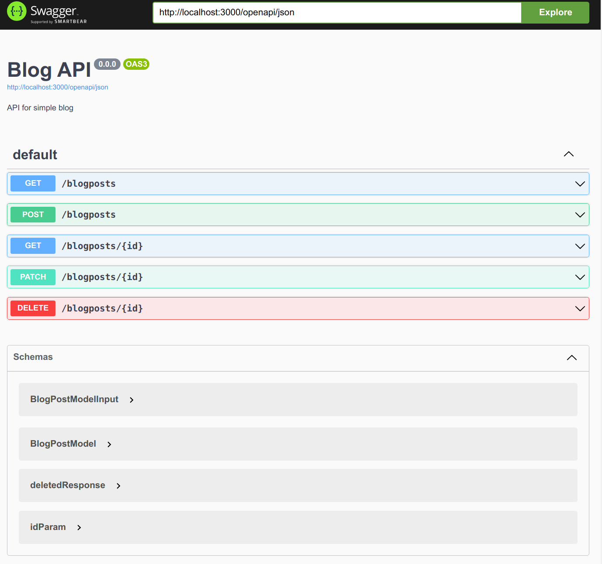
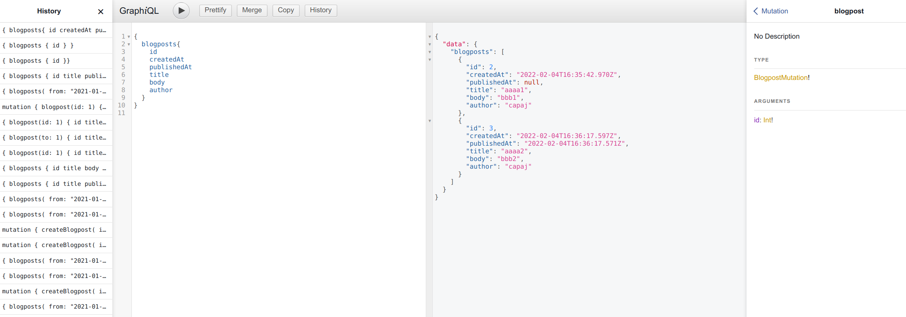

# node-rest-vs-graphql

comparison of two implementations of the same dead simple CRUD API using REST and Graphql

This showcase was created mostly to refute misleading myths developers tell themselves about graphql having more overhead than REST.

Both branches have the same CRUD functionality over a single db table:

- query for blogpost with filtering by from and to dates
- query to fetch a single blogpost
- mutation to create a new post, update existing one and delete a blogpost

Graphql schema is built using typegraphql, but other frameworks are similar in verbosity.

For REST, we have swagger docs:

For graphiql we have graphiql bundled with mercurius:

